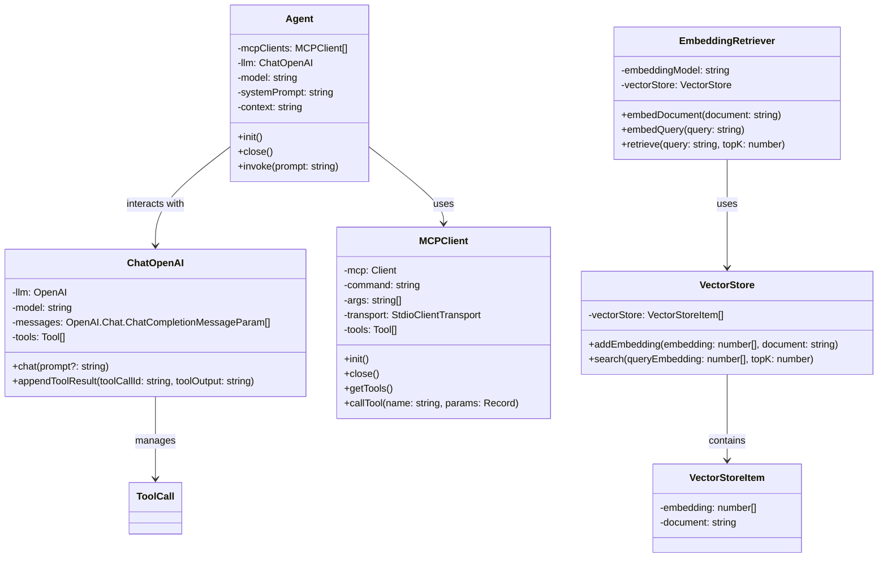
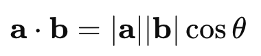
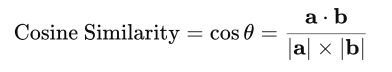
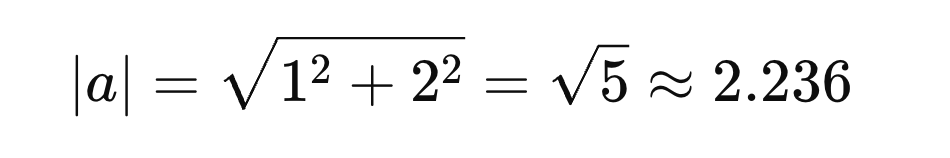

# LLM + MCP + RAG

## 目标

- **Augmented LLM** (Chat + MCP + RAG)
- 不依赖框架
    - LangChain, LlamaIndex, CrewAI, AutoGen
- **MCP**
    - 支持配置多个MCP Serves
- **RAG** 极度简化板
    - 从知识中检索出有关信息，注入到上下文
- **任务**
   - 阅读网页 → 整理一份总结 → 保存到文件
   - 本地文档 → 查询相关资料 → 注入上下文

## **The augmented LLM**

- [Building Effective Agents](https://www.anthropic.com/engineering/building-effective-agents)




## **依赖**

```bash
git clone git@github.com:KelvinQiu802/ts-node-esm-template.git
pnpm install
pnpm add dotenv openai @modelcontextprotocol/sdk chalk**
```

## LLM

- [OpenAI API](https://platform.openai.com/docs/api-reference/chat)

## MCP

- [MCP 架构](https://modelcontextprotocol.io/docs/concepts/architecture)
- [MCP Client](https://modelcontextprotocol.io/quickstart/client)
- [Fetch MCP](https://github.com/modelcontextprotocol/servers/tree/main/src/fetch)
- [Filesystem MCP](https://github.com/modelcontextprotocol/servers/tree/main/src/filesystem)

## RAG

- [Retrieval Augmented Generation](https://scriv.ai/guides/retrieval-augmented-generation-overview/)
    - 译文: https://www.yuque.com/serviceup/misc/cn-retrieval-augmented-generation-overview
- 各种Loaders: https://python.langchain.com/docs/integrations/document_loaders/
- [硅基流动](https://cloud.siliconflow.cn/models)
    - 邀请码： **x771DtAF**
- [json数据](https://jsonplaceholder.typicode.com/)

## 向量

- 维度
- 模长
- 点乘 Dot Product
    - 对应位置元素的积，求和
- 余弦相似度 cos
    - 1 → 方向完全一致
    - 0 → 垂直
    - -1 → 完全想法







