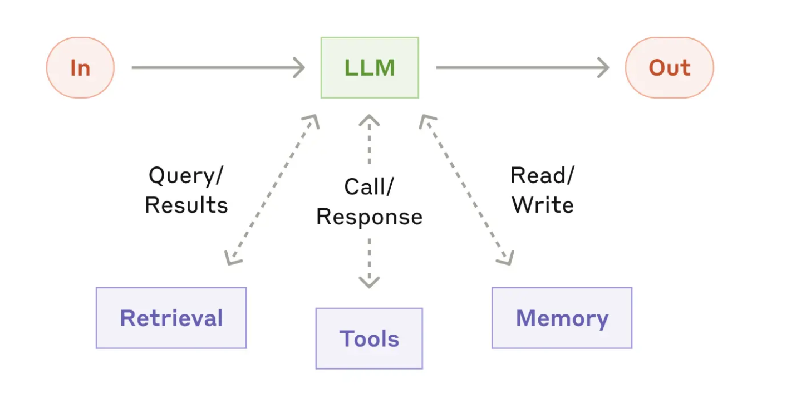
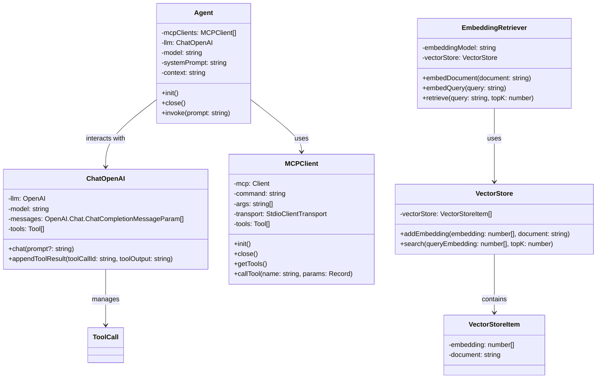

# LLM + MCP + RAG

## 目标

- **Augmented LLM** (Chat + MCP + RAG)
- 不依赖框架
    - LangChain, LlamaIndex, CrewAI, AutoGen
- **MCP**
    - 支持配置多个MCP Servers
- **RAG** 极度简化板
    - 从知识中检索出有关信息，注入到上下文
- **任务**
   - 阅读网页 → 整理一份总结 → 保存到文件
   - 本地文档 → 查询相关资料 → 注入上下文

## **The augmented LLM**

- [Building Effective Agents](https://www.anthropic.com/engineering/building-effective-agents)





## **依赖**

```bash
git clone git@github.com:KelvinQiu802/ts-node-esm-template.git
pnpm install
pnpm add dotenv openai @modelcontextprotocol/sdk chalk**
```

## LLM

- [OpenAI API](https://platform.openai.com/docs/api-reference/chat)

## MCP

- [MCP 架构](https://modelcontextprotocol.io/docs/concepts/architecture)
- [MCP Client](https://modelcontextprotocol.io/quickstart/client)
- [Fetch MCP](https://github.com/modelcontextprotocol/servers/tree/main/src/fetch)
- [Filesystem MCP](https://github.com/modelcontextprotocol/servers/tree/main/src/filesystem)

## RAG

- [Retrieval Augmented Generation](https://scriv.ai/guides/retrieval-augmented-generation-overview/)
    - 译文: https://www.yuque.com/serviceup/misc/cn-retrieval-augmented-generation-overview
- 各种Loaders: https://python.langchain.com/docs/integrations/document_loaders/
    - 目前的实现只是简单直接使用了 fs 读取文件，更标准的方法是使用 LangChain 的 document loaders 去加载文件
    - Document Loader → Text Splitter → Embedding → Vector Store

- [硅基流动](https://cloud.siliconflow.cn/models)
    - 邀请码： **x771DtAF**
- [json数据](https://jsonplaceholder.typicode.com/)


## 运行流程
1. RAG，先为文件构造向量数据库，然后根据 task 获取关联度最高的内容作为 context
2. MCP，构造 MCP clients
3. Agent 构造时，传入 context 以及 MCP clients
4. agent.init() 中，获取所有 mcp 的 tools，传入构建一个 ChatOpenAI
5. agent.invoke(prompt) 里，会调用 ChatOpenAI.chat()，该方法会构建 OpenAI 的 chat，传入这些 tools，system prompt 还有 context，然后处理流式响应。处理完成后获得所有 content 和 tool calls
6. 回到 agent.invoke，对于 tool calls，根据名字匹配，然后调用对应mcp 的 callTool()
7. 将 tool calls 结果 push 回 message 里：
```ts
 public appendToolResult(toolCallId: string, toolOutput: string) {
        this.messages.push({
            role: "tool",
            content: toolOutput,
            tool_call_id: toolCallId
        });
    }
```
8. 继续进行 llm.chat，直到没有 tool calls 就说明这次对话结束了


## 知识
每次继续对话都要重新调用 llm.chat.completions.create(), 传输完整的 messages 历史，因为 OpenAI 设计它不会在服务器维护历史消息。可能的优化方法是：消息压缩，设置消息数量上限（slice掉旧消息），比如 LangChain 使用 Memory 组件来管理历史，里面就有：ConversationSummaryMemory, ConversationBufferWindowMemory

